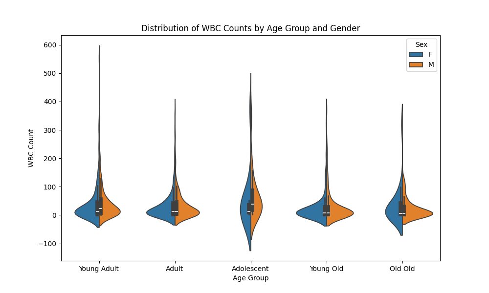

These are the outputs, you can crosscheck.

For example, for the `statistics_t_test`, the output is this:

biomarker feature groupA groupB groupA_n groupB_n groupA_mean groupB_mean groupA_std groupB_std t_stat p_value  
extra extra 1 2 10 10 0.75 2.3299999999999996 1.7890096577591625 2.002248735796829 -1.8608134674868524 0.07918671421593829

As an example, output of the `visualization_violin_plot` is this:

Example visualization survival plot is here: 

